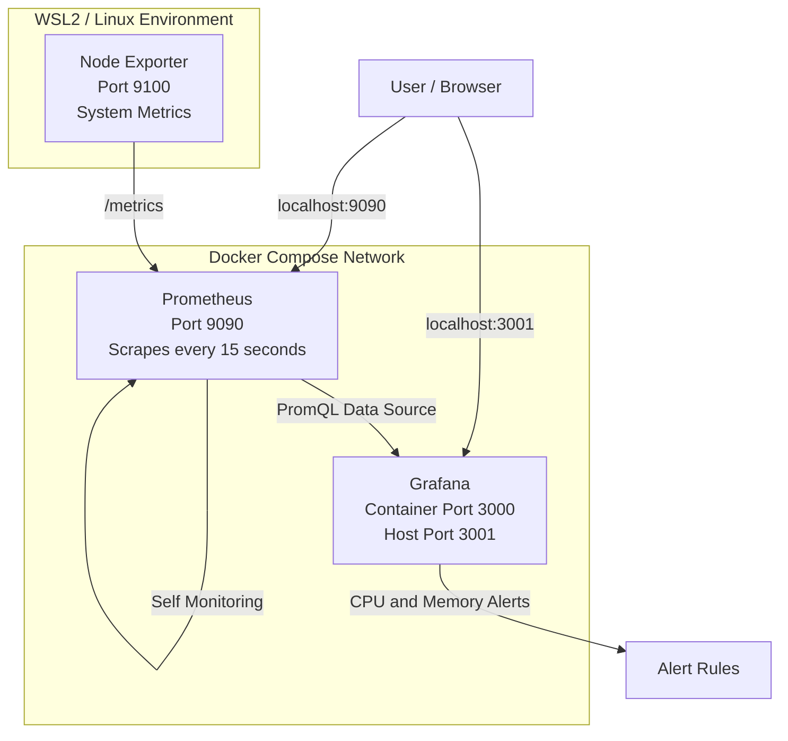

# Cloud Infrastructure Monitoring Architecture

```mermaid
flowchart TD
    U["User / Browser"]

    subgraph HOST["WSL2 / Linux Environment"]
        NE["Node Exporter<br/>Port 9100<br/>System Metrics"]
    end

    subgraph DOCKER["Docker Compose Network"]
        P["Prometheus<br/>Port 9090<br/>Scrapes every 15 seconds"]
        G["Grafana<br/>Container Port 3000<br/>Host Port 3001"]
    end

    U -->|"localhost:3001"| G
    U -->|"localhost:9090"| P
    NE -->|"/metrics"| P
    P -->|"PromQL Data Source"| G
    P -->|"Self Monitoring"| P

    G -->|"CPU and Memory Alerts"| A["Alert Rules"]

```
